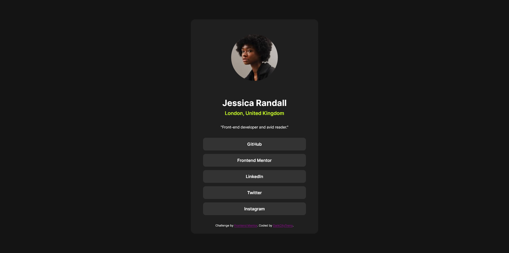

# Frontend Mentor - Social links profile solution

This is a solution to the [Social links profile challenge on Frontend Mentor](https://www.frontendmentor.io/challenges/social-links-profile-UG32l9m6dQ). Frontend Mentor challenges help you improve your coding skills by building realistic projects.

## Table of contents

- [Overview](#overview)
  - [The challenge](#the-challenge)
  - [Screenshot](#screenshot)
- [My process](#my-process)
  - [Built with](#built-with)
  - [What I learned](#what-i-learned)
- [Author](#author)

## Overview

### The challenge

Users should be able to:

- See hover and focus states for all interactive elements on the page

### Screenshot

### Built with

- Semantic HTML5 markup
- Flexbox
- CSS Grid

### What I learned

Learned some buttons stuff and the border-radius: 50%; neat trick for rounded images.

## Author

- Website - [DarkCityTreno](https://github.com/DarkCityTreno)
- Frontend Mentor - [@DarkCityTreno](https://www.frontendmentor.io/profile/yourusername)
